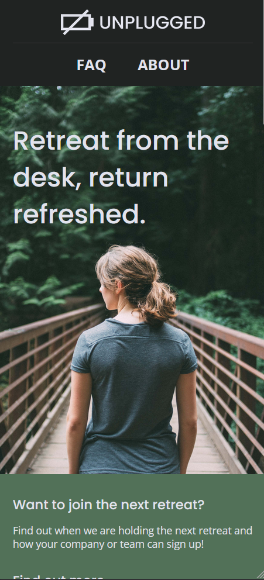
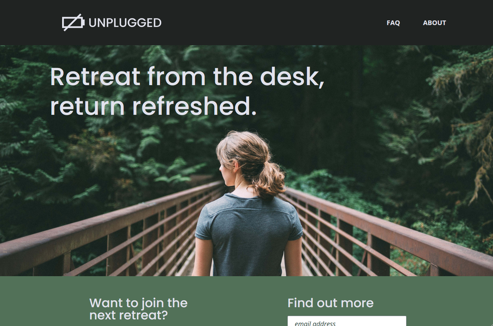

# Skillcrush - Unplugged Retreat Website Mock-Up

This is the code for a mock-up multipage website for a corporate wellness retreat resort for [Skillcrush](https://skillcrush.com/).

## Table of contents

- [Overview](#overview)
  - [The challenge](#the-challenge)
  - [Screenshot](#screenshot)
  - [Links](#links)
- [My process](#my-process)
  - [Built with](#built-with)
- [Author](#author)

## Overview

### The challenge

Users should be able to:

- View the optimal layout depending on their device's screen size
- Click back and forth between different pages

### Screenshot

### Links

- Code URL: [https://github.com/amidona/unplugged-retreat](https://github.com/amidona/unplugged-retreat)
- Live Site URL: [https://amidona.github.io/unplugged-retreat/index.html](https://amidona.github.io/unplugged-retreat/index.html)

## My process

### Built with

- Semantic HTML5 markup
- Flexbox
- Mobile-first workflow
- Vanilla JavaScript

## Author

- Website - [Allyce Amidon](https://allyceamidon.com/)
- GitHub - [@amidona](https://github.com/amidona)

